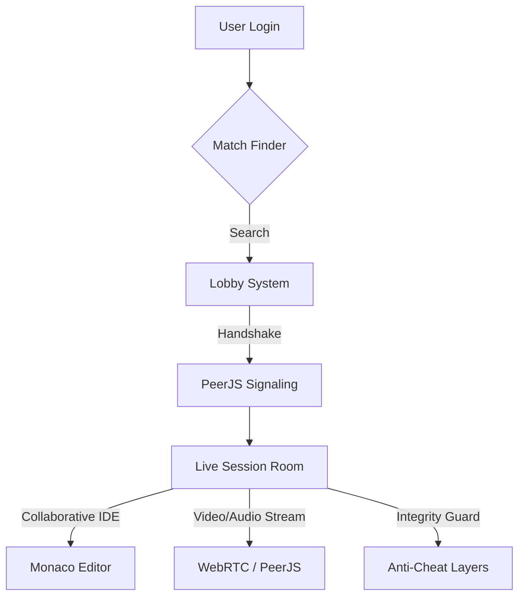
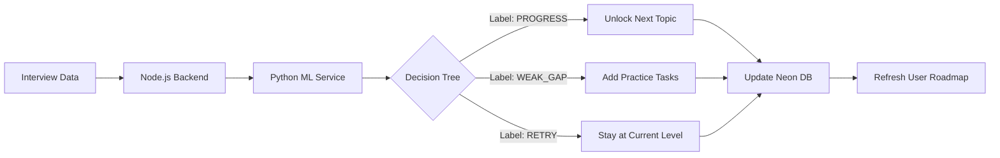

# 🕸️ InterviewMesh: The P2P Mock Interview Ecosystem

> **Bridging the gap between static coding and real-time performance.**

InterviewMesh is a next-generation platform designed to revolutionize technical interview preparation. Unlike traditional "grinding" platforms, InterviewMesh focuses on the **human element**, providing a real-time, peer-to-peer ecosystem powered by **ML-driven roadmap evolution**.

---

## 💎 The "Vector Visionary" Unique Proposition

At the heart of InterviewMesh is the **Vector Visionary Roadmap Creator**. This isn't just a static progress bar; it is a dynamic, self-evolving learning path that adapts in real-time based on your interview performance.

| Feature | InterviewMesh | Traditional Platforms |
| :--- | :--- | :--- |
| **Feedback Loop** | Instant ML-driven "Labeling" | Static "Pass/Fail" tests |
| **Roadmap** | Self-Evolving (Vector Visionary) | Fixed static syllabus |
| **Connectivity** | Live P2P Video/Audio | Solo practice only |
| **Integrity** | Real-time Tab/Paste tracking | No anti-cheat monitoring |

---

## 🛠️ System Architecture & Workflow

The platform follows a distributed microservices model to ensure low latency and high stability during live sessions.

### 1. User & Connectivity Flow


### 2. The Vector Visionary Logic (ML Pipeline)
Every interview session generates metadata that is piped through our Python ML engine to update your roadmap.



---

## 🚀 Technical Stack

### **Frontend (The Experience Layer)**
- **React 18 + Vite**: For ultra-fast HMR and premium performance.
- **Tailwind CSS**: Custom "Glassmorphism" design system.
- **Framer Motion**: Smooth 60fps animations and transitions.
- **Socket.io-client**: Real-time event synchronization.

### **Backend (The Orchestration Layer)**
- **Node.js + Express**: Core business logic and API routing.
- **Socket.io**: Lobby management and signaling.
- **Neon PostgreSQL**: Serverless database for high-availability storage.
  - *Note: Implemented a WebSocket bypass for Port 5432 to circumvent ISP-level blocking.*

### **ML Microservice (The Intelligence Layer)**
- **Python Flask**: RESTful API for ML interference.
- **Scikit-learn**: Decision Tree Classifier trained on 20+ interview performance vectors.
- **Gemini 2.0 Flash**: Integrated for real-time question generation and hint systems.

---

## 🔐 Real-Time Integrity Guard
InterviewMesh features a sophisticated "Anti-Cheat" layer to ensure the quality of mock sessions:
- **Clipboard Monitoring**: Detects and alerts if code is pasted into the editor.
- **Tab Switching Detection**: Notifies the partner if the user leaves the interview tab.
- **Activity Heartbeats**: Ensures both parties remain active during the session.

---

## ⚡ Quick Demo Setup

### Prerequisites
- Node.js (v16+)
- Python 3.10+
- PostgreSQL (Neon recommended)

### Installation
1. **Clone the Repo**
   ```bash
   git clone https://github.com/ShreyanshGiri08/DevStakes_Project
   cd interviewmesh
   ```
2. **Install Dependencies**
   ```bash
   npm install        # Root
   cd client && npm install
   cd ../server && npm install
   cd ../ml && pip install -r requirements.txt
   ```
3. **Environment Setup**
   Create a `.env` in the `server` folder:
   ```env
   DATABASE_URL=your_neon_db_url
   GOOGLE_CLIENT_ID=your_id
   ML_SERVICE_URL=http://localhost:5000
   ```
4. **Run the Mesh**
   ```bash
   # Terminal 1: Backend
   npm run start
   
   # Terminal 2: Frontend
   npm run dev
   
   # Terminal 3: ML Service
   python ml/app.py
   ```

---

## 🔮 Roadmap Creator Credits
The core logic for the roadmap visualization was inspired by and integrated from the [DevStakes Project](https://github.com/ShreyanshGiri08/DevStakes_Project), specifically focusing on the node-based vector progression system which we have enhanced with real-time ML triggers.
